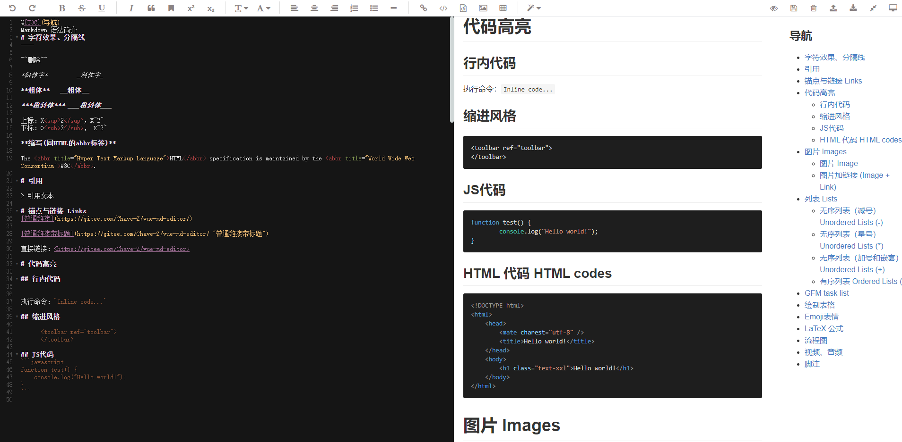

## vue2-codemirror-markdown

`vue2-codemirror-markdown` 是一款基于 `vue` 的 `Markdown` 编辑器，功能正在更新中，欢迎反馈。功能相关问题反馈或建议可以提交 issues 。

<!-- ## 编辑器演示
预览地址：http://127.0.0.1 -->

### 预览图 

###  快速上手 
#### 下载插件
```shell
$ npm i vue2-codemirror-markdown --save
``` 
#### 使用
```vue
<template>
  <div class="editor-box"> 
    <Vue2CodemirrorMarkdown 
        v-model="value"
        :indentUnit="2"
        :fullscreen="false"
        :hljsCss="hljsCss"
        :imageUploader="imageUploader"
        @save="save"/>  
  </div>
</template>

<script>
import Vue2CodemirrorMarkdown from 'vue2-codemirror-markdown'
export default {
    name: 'app',
    components: { Vue2CodemirrorMarkdown },
    data() {
        return {
            url: "http://127.0.0.1:82/upload",
            data: {},
            header: {},
            onChange: (data) => {
                console.log(data);
            },
        }
    },
    methods: { 
        save(val) {
            // 获取预览文本
            console.log(this.value)
            console.log(val)
        }
    },
    mounted() {
    }
}
</script>
<style lang="scss" scoped>
.editor-box{
  height: 100vh;
}
</style>
```

#### 配置说明
| 属性        | 说明                                           | 类型    | 默认值                    |
|:------------|:-----------------------------------------------|:--------|:--------------------------|
| config  | 编辑器相关配置（https://codemirror.net/doc/manual.html#config）以及额外配置             | Object  | 见额外配置                        |

#### Props 属性
| 属性        | 说明                                           | 类型    | 默认值                    |
|:------------|:-----------------------------------------------|:--------|:--------------------------|
| value       | 可以使用 v-model 双向绑定数据                  | String  | ''                        |
| theme       | 编辑器主题                                     | String  | 'base16-dark'             |
| font        | 设置编辑区和展示区的文字大小                   | Object  | {editor: 16, preview: 16} |
<!-- | shadow      | 编辑器是否带阴影效果                           | Boolean | true                      | -->
<!-- | dragUpload  | 是否允许拖拽上传图片，需要结合图片上传配置使用 | Boolean | true                      | -->
| showToolbar | 是否显示工具栏                                 | Boolean | true                      |
| toolbar     | 菜单栏及快捷键的功能                           | Object  | 见下文                    |
| hljsCss     | html显示区域代码高亮样式                       | String  | 'github'                  |
| fullscreen  | 编辑器是否默认全屏                             | boolean | false                     |
| indentUnit  | 编辑器缩进大小（默认两个空格）                 | Number  | 2                         |

#### 菜单栏配置配置
```html
// 默认菜单栏配置
toolbar: {
    undo: true, // 撤销
    redo: true, // 重做
    bold: true, // 粗体
    del: true, // 删除线
    underline: true, // 下划线
    italic: true, // 斜体
    quote: true, // 引用
    bookmark: true, // 标记
    superscript: true, // 上角标
    subscript: true, // 下角标
    h1: true, // 标题1
    h2: true, // 标题2
    h3: true, // 标题3
    h4: true, // 标题4
    h5: true, // 标题5
    h6: true, // 标题6
    alignLeft: true, // 居左
    alignCenter: true, // 居中
    alignRight: true, // 居右
    ol: true, // 有序列表
    ul: true, // 无序列表
    hr: true, // 分隔线
    link: true, // 链接
    inlineCode: true, // 行内代码
    code: true, // 代码块
    image: true, // 图片
    table: true, // 表格
    skin: true, // 皮肤
    fullScreenEdit: true, // 全屏编辑
    fullScreen: true, // 全窗口预览
    preview: true,  // 实时预览
    save: true,  // 保存预览的html文本
}
```
 
##### hljsCss可用属性值
样式提取自highlight.js，显示效果可参考：https://highlightjs.org/

支持的样式值如下

```json
a11yDark
a11yLight
agate
anOldHope
androidstudio
arduinoLight
arta
ascetic
atelierCaveDark
atelierCaveLight
atelierDuneDark
atelierDuneLight
atelierEstuaryDark
atelierEstuaryLight
atelierForestDark
atelierForestLight
atelierHeathDark
atelierHeathLight
atelierLakesideDark
atelierLakesideLight
atelierPlateauDark
atelierPlateauLight
atelierSavannaDark
atelierSavannaLight
atelierSeasideDark
atelierSeasideLight
atelierSulphurpoolDark
atelierSulphurpoolLight
atomOneDarkReasonable
atomOneDark
atomOneLight
brownPaper
codepenEmbed
colorBrewer
darcula
dark
darkula
default
docco
dracula
far
foundation
githubGist
github
gml
googlecode
gradientDark
grayscale
gruvboxDark
gruvboxLight
hopscotch
hybrid
idea
irBlack
isblEditorDark
isblEditorLight
'kimbie.dark'
'kimbie.light'
lightfair
magula
monoBlue
monokaiSublime
monokai
nightOwl
nord
obsidian
ocean
paraisoDark
paraisoLight
pojoaque
purebasic
qtcreatorDark
qtcreatorLight
railscasts
rainbow
routeros
schoolBook
shadesOfPurple
solarizedDark
solarizedLight
sunburst
tomorrowNightBlue
tomorrowNightBright
tomorrowNightEighties
tomorrowNight
tomorrow
vs
vs2015
xcode
xt256
zenburn
```